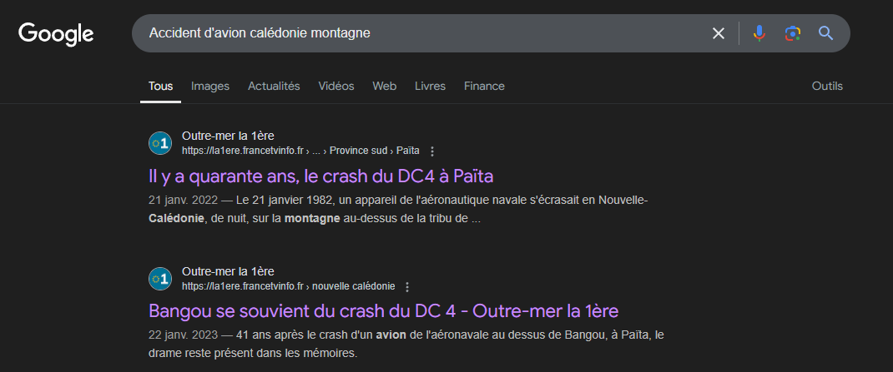
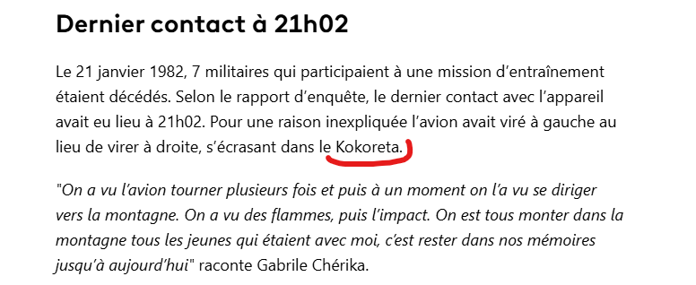
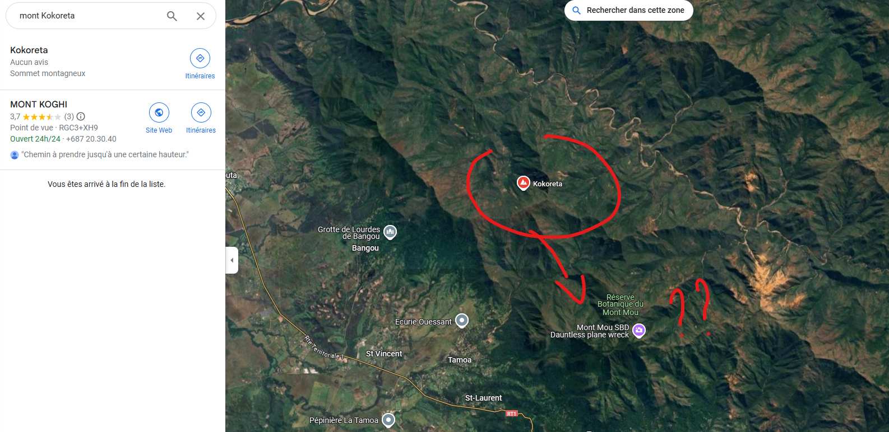
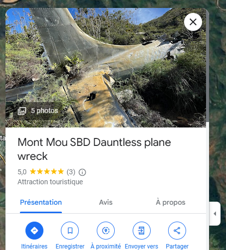
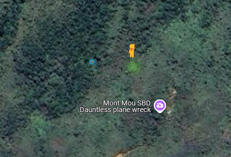
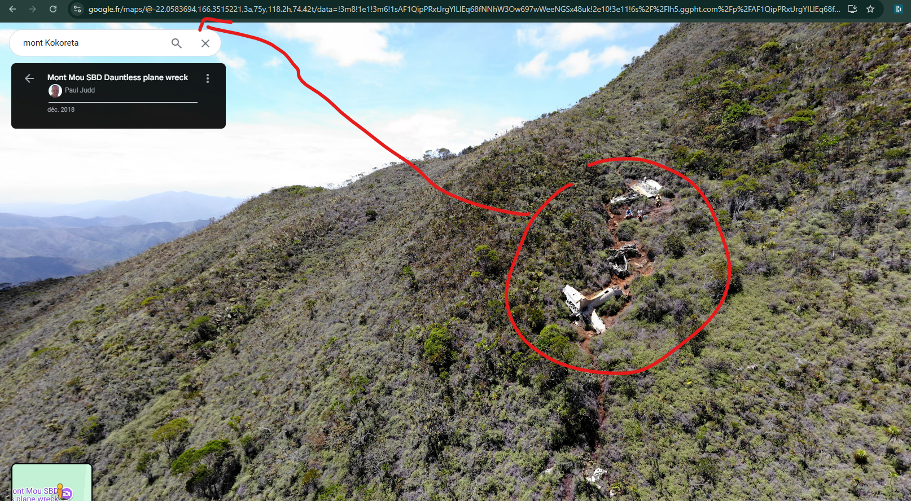

Une longue randonnée lourde de sens en arrivant proche de ce site au combien important et chargé d'histoire. Seriez-vous capable de me donner mes coordonnée gps (2 chiffres après le point.)

Format du flag ``OPENNC{LAT.XX,LONG.XX}``

# Résolution

Alors pour ceux qui connaissent bien, ça prend deux secondes. Pour les autres, vu la décomposition de l'avion, ça date clairement et en NC c'est un phénomène assez rare donc se trouve facillement.

https://la1ere.francetvinfo.fr/nouvellecaledonie/province-sud/paita/bangou-se-souvient-du-crash-du-dc-4-1359358.html

On recherche le mont sur google map : 

AH ! une zone touristique ? 

Si on prenait notre petit bonhomme streetview ?

flag : ``OPENNC{-22.05,166.35}``