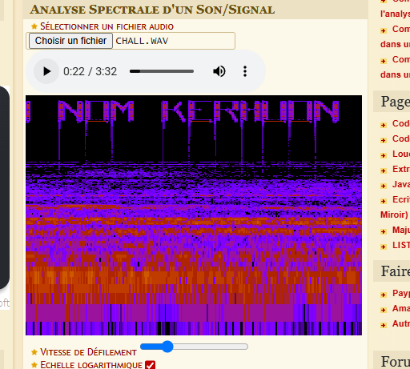

## Scénario

Au cœur du musée de Sydney repose l'un des artefacts les plus mystérieux et précieux de l'histoire, datant d'une époque bien antérieure à celle des dinosaures. Personne ne peut dire avec certitude d'où il provient ni à quelle civilisation il appartenait – peut-être une culture avancée depuis longtemps disparue. Une chose est sûre quelque chose est arrivé.

En vous approchant de cette sphère énigmatique, vous ressentez d'étranges vibrations. Serait-ce un message caché ?

Trouvez le nom de ce qui les a fait disparaitre.

**Format du flag :** ``OPENNC{NOM}``

**Auteur :** ``Ketsui``

