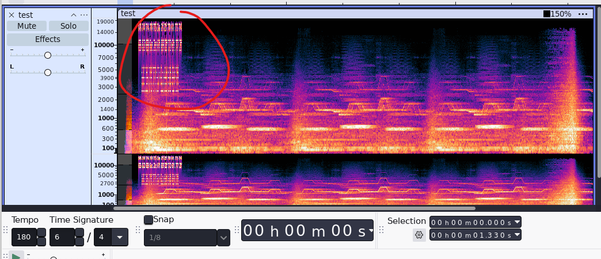
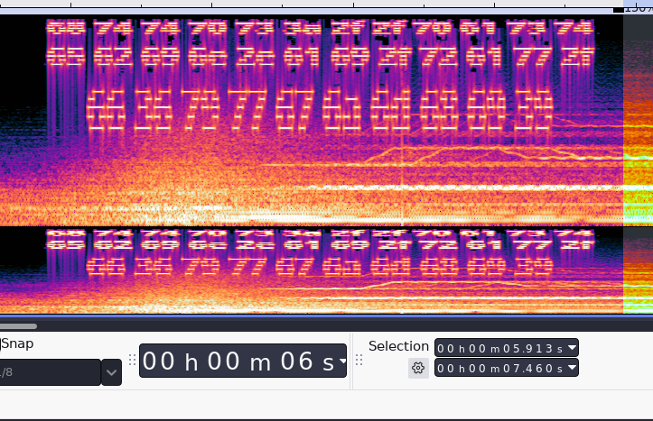
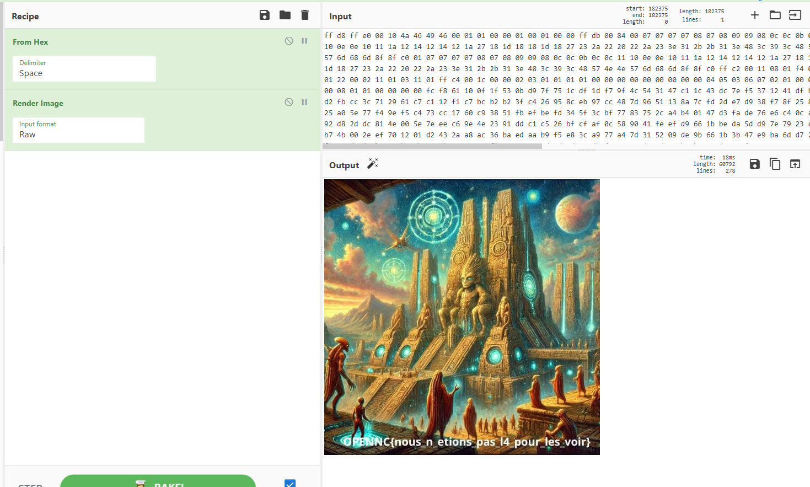

## Mission

Trouver ce que cet artefact veut vous transmettre. 


## Résolution

Nous avons un fichier audio, en l'écoutant on remarque des bruits claairement pas là par hasard.

On passe le fichier dans audacity et on observe les spectogrames.



OK ! interessant. et si nous zoomons ?





Il faut jouer avec le tempo et les variations de fréquences pour pouvoir déterminer les caractères.


Nous etions fort et prospere mais un mal redoutable est arrive voici son nom KERHUON


Flag : ``OPENNC{KERHUON}``


Cela nous donne : 

```bash
68 74 74 70 73 3a 2f 2f 70 61 73 74 65 62 69 6e 2e 63 6f 6d 2f 72 61 77 2f 41 56 45 30 59 37 73 48
```


Passant ce hex dans cyberchef :

https://pastebin.com/raw/AVE0Y7sH


Essayant de la passé aussi dans cyberchef





Flag : ``OPENNC{nous_n_etions_pas_l4_pour_les_voir}``


